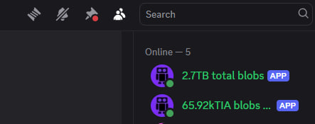

# celestia-blob-fee-bot

This is a discord bot project that displays information about total paid commissions for adding blobs on the Celestia network.

The information is displayed in the form of the bot name. Therefore, the current value can always be seen on the right side of the Discord interface, in the list of users. This is done following the example of price-bots.




Here as well, a second bot has been added to display the total size of blobs

## Install

To start the project you will need:

* Machine with installed NodeJS and  Postgres database

* Celestia Archival API endpoint

* 2 discord-bot tokens ( One for Fee and one for Blobs size displaying, see https://discord.com/developers/applications)

### Steps

1. Clone this repo

2. run ```npm i```

3. copy environmet template to .env ```cp .env.template  .env```

4. fill your credentials to .env

5. run bot with ``` npm start ```


it's going to take a while to find all blob-fee transactions


### run with PM2
```bash
pm2 start src/index.js --name "tia-discord-blob-bot"
```

### Database migrations

run this command for apply all migrations:

```bash
npx knex migrate:latest --knexfile ./knexfile.js
```

migration rollback:

```bash
npx knex migrate:rollback --knexfile ./knexfile.js
```

1. Add timestamp column and height, timestamp indexing

